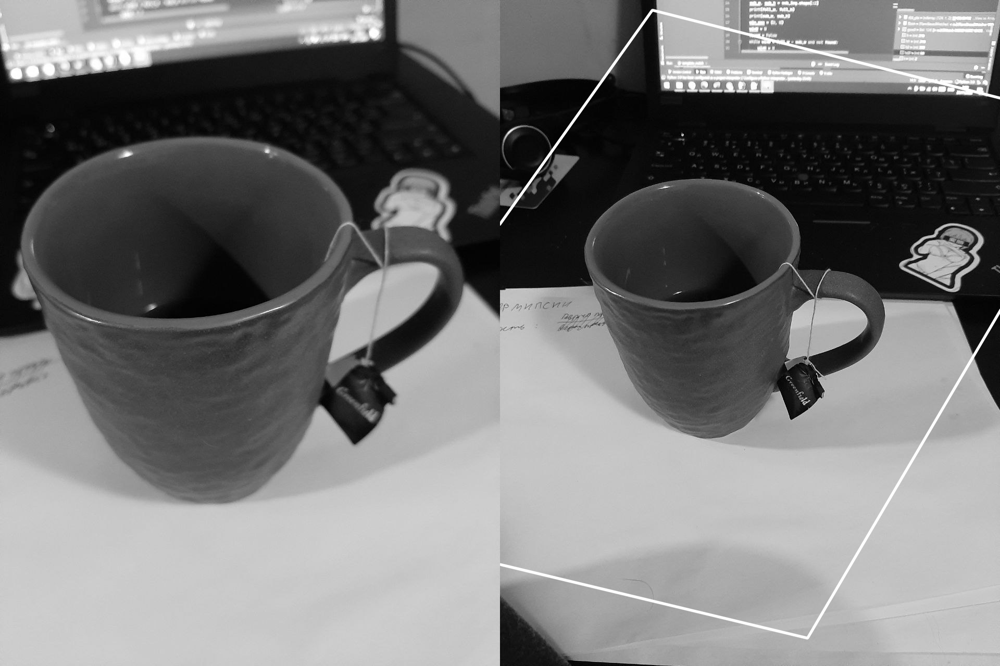
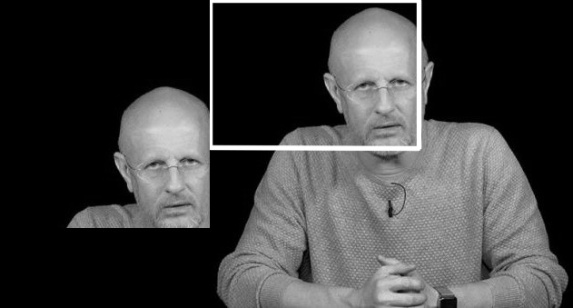
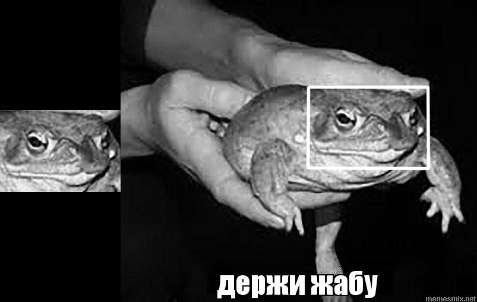
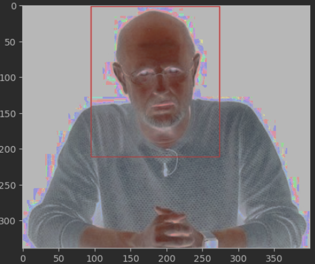
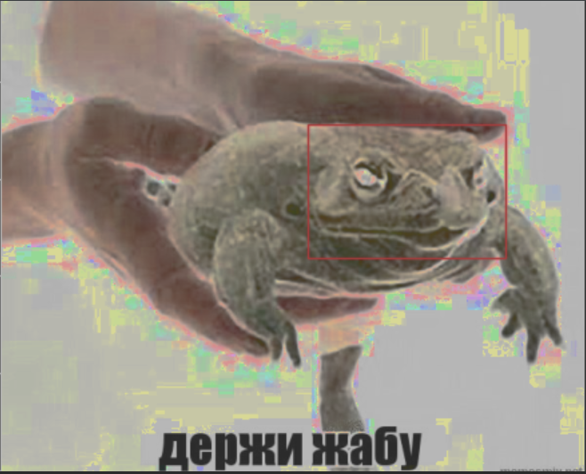

## Поиск шаблонов

Реализовано два детектера объектов

Файл template_match.py содержит примитивную реализацию поиска шаблона. Программа принимает на вход исходное изображение и фрагмент исходного изображения. 
Скользящим окном производится поиск изображения.

## SIFT

Файл SIFT содержит реализацию алгоритма поиска ключевых точек и создания дескрипторов точек.

Сначала вычисляется пирамида гауссиан для изображения. После вычисляется пирамида разности гауссиан
Затем по экстремумам находятся ключевые точки и строятся дескрипторы для ключевых точек.

## sift_usage.py

С помощью реализованного алгоритма вычисляются ключевые точки и их дескрипторы для двух изображений
Далее посредством cv2.FlannBasedMatcher происходит поиск и сопоставление найденных дескрипторов.
Потом с помощью библиотечных функций происходит наложение найденного фрагмента на исходное изображение
```python
    M = cv2.findHomography(src_pts, dst_pts, cv2.RANSAC, 5.0)[0]

    # Draw detected template in scene image
    h, w = img1.shape
    pts = np.float32([[0, 0],
                      [0, h - 1],
                      [w - 1, h - 1],
                      [w - 1, 0]]).reshape(-1, 1, 2)
    dst = cv2.perspectiveTransform(pts, M)

    img2 = cv2.polylines(img2, [np.int32(dst)], True, 255, 3, cv2.LINE_AA)
```

## Результат рабооты

Алгоритм SIFT:
1. 
2. 
3. 

Алгоритм поиска шаблонов:
1. 
2. 
3. Эксперименты показали, что, при искажении шаблона на изображении, алгоритм поиска шаблонов не находит шаблон на изображении 