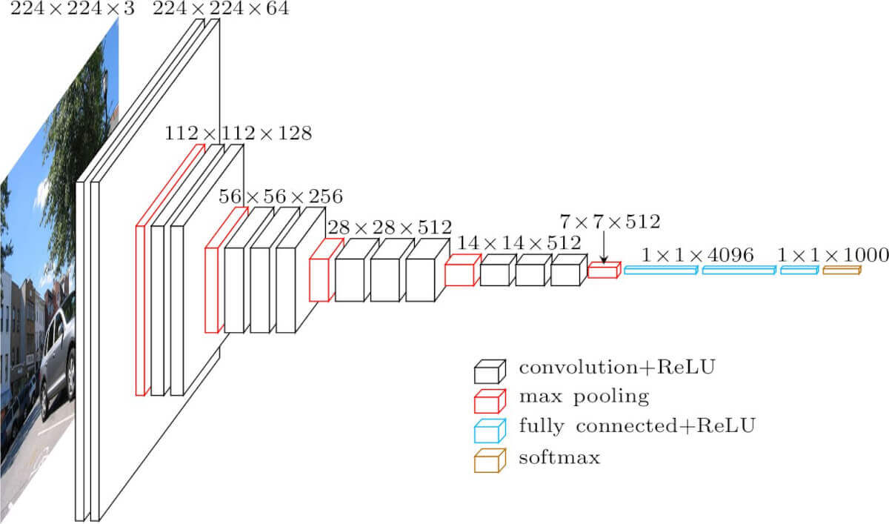
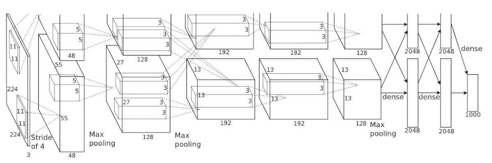
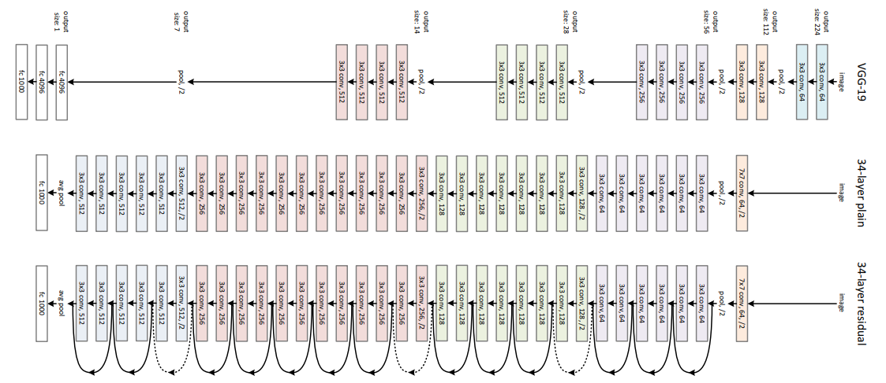
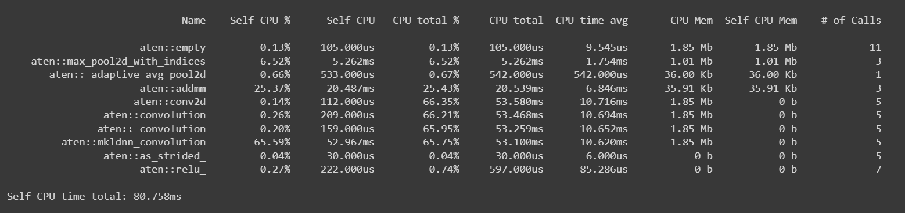
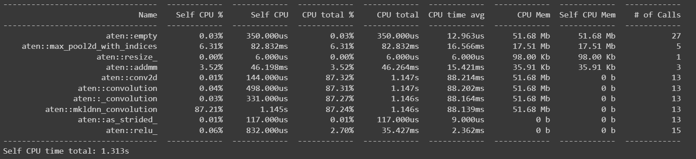
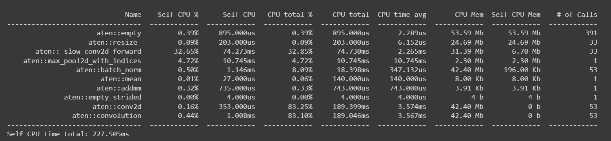

# LW3

## Задание
- 1. Реализовать систему классификации согласно описанию, используя не
     менее трех различных архитектур нейронной сети.
- 2. Сравнить качество работы, скорость и количество потребляемой памяти
     для каждой архитектуры.
- 3. Сделать отчёт в виде readme на GitHub, там же должен быть выложен
     исходный код.

## Теоретическая база
Классификация изображений – это процесс извлечения классов информации из многоканального растрового изображения.
Растр, полученный в результате классификации изображения, можно использовать для создания тематических карт.
В зависимости от характера взаимодействия аналитика с компьютером в процессе классификации, различают два
типа классификации изображений: классификацию с обучением и классификацию без обучения.

# VGG 16

# AlexNet

# ResNet

## Результат работы
Результат работы сетей представлен ниже:

| accuracy   | vgg    | alexnet | resnet50 |
|------------|--------|---------|----------|
| top1       | 0.84   | 0.72    | 0.88     |
| top5       | 1.0    | 0.9     | 1.0      |

Как видно из результатов работы, наибольшей точностью обладает сеть resnet50.

Результаты замеров расхода памяти / времени:
### AlexNet

### VGG16

### ResNet

по памяти самый тяжелый VGG, самый легкий alex net

## Источники мои источники
- https://pytorch.org/vision/stable/models.html
- https://neurohive.io/ru/vidy-nejrosetej/vgg16-model/
- https://towardsdatascience.com/alexnet-the-architecture-that-challenged-cnns-e406d5297951
- https://habr.com/ru/company/nix/blog/430524/